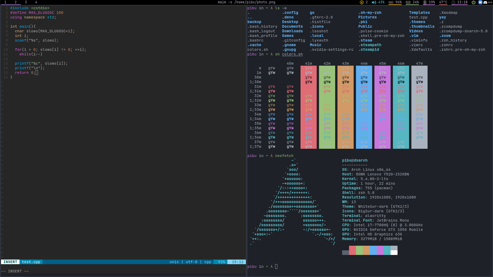

# DOTFILES
#### comments
+ xorg is necessary
+ my keyboard layout (.Xmodmap) is unique
## dependiences
### for the window manager (i3 + polybar)
+ i3 or i3-gaps
+ polybar
+ rofi
+ maim
+ xclip
+ ntdp
+ alacritty
+ feh
+ xset
+ nvidia-settings
+ fonts -> [JetBrains Mono Medium](https://www.jetbrains.com/lp/mono/) + [Font Awesome 5 Free](https://fontawesome.com) (it can be changed to [Nerd Font](https://www.nerdfonts.com/), also in configs)
+ xfce4-power-manager
### the terminal side
+ alacritty
+ zsh + oh-my-zsh + plugins
+ vim + vundle (it installs plugins)
+ font ([JetBrains Mono Regular](https://www.jetbrains.com/lp/mono/)
+ lf (file manager)
### how it looks like

